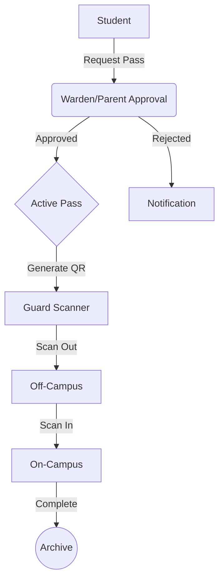

# PassOS | Multi-Tenant Campus Mobility SaaS

PassOS is a modern, production-grade gatepass management system designed for multi-university deployments. It digitizes the entire lifecycle of student movement, featuring cryptographic pass verification, hierarchical RBAC, and automated behavioral analytics across isolated tenants.

---

## 🌟 Vision & Impact

PassOS replaces traditional, error-prone manual registers with a secure, digital ecosystem. It is built to handle the scale of multiple institutions while maintaining strict data residency and security for each.

### Core Value Proposition
- **Cryptographic Security**: Forgery-proof passes using HMAC-signed JWTs.
- **Operational Efficiency**: 80% reduction in gate congestion via high-speed QR scanning.
- **Unified Analytics**: Real-time insights into campus occupancy and student mobility patterns.
- **Zero Infrastructure**: Cloud-native architecture with minimal hardware requirements.

### System Lifecycle

---

## 📖 Documentation Ecosystem

| Resource | Description |
| :--- | :--- |
| [**Project Overview**](./PROJECT_OVERVIEW.md) | Comprehensive feature breakdown and economic impact. |
| [**Architecture Guide**](./docs/architecture.md) | Deep dive into the security model and state machine. |
| [**API Reference**](./docs/api.md) | Documentation for core system endpoints. |
| [**Database Guide**](./docs/database.md) | Schema definitions and RLS policy documentation. |
| [**n8n Workflows**](./docs/workflows.md) | Automated alerts, digests, and escalation logic. |
| [**Security Protocols**](./docs/security.md) | Consolidated security and multi-tenancy audit. |

---

## 🛠️ Architecture Highlights

- **Frontend**: Next.js 16 (App Router), React 19, Tailwind CSS 4, Framer Motion 12.
- **Backend**: Supabase (PostgreSQL, Auth, Storage, Edge Functions).
- **Security**: `jose` (JWT), `Zod` (Validation), HMAC-SHA256, PostgreSQL RLS.
- **Automation**: n8n workflows for background processing and alerts.

---

## 🗺️ Roadmap & Changelog

We are actively developing PassOS. Check our progress:
- [**Roadmap**](./ROADMAP.md): Upcoming features and strategic goals.
- [**Changelog**](./CHANGELOG.md): History of releases and updates.

---

## 🤝 Contributing & Community

Even as a proprietary project, we maintain high standards for collaboration.
- [**Contributing Guidelines**](./CONTRIBUTING.md)
- [**Code of Conduct**](./CODE_OF_CONDUCT.md)

---

## 📄 License

This project is proprietary. All rights reserved. For licensing inquiries, please contact the repository owner.
