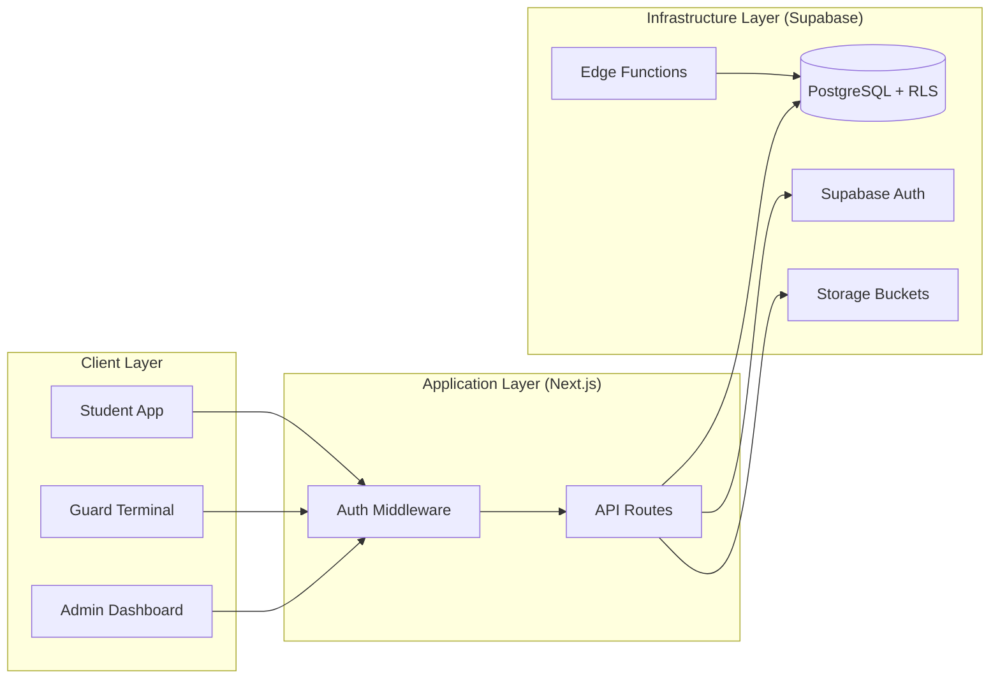
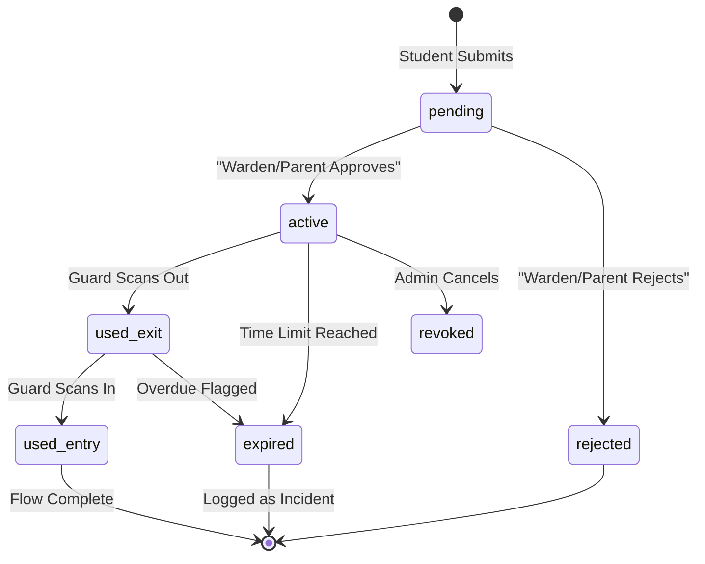

# PassOS Architecture Guide

This document describes the high-level architecture, security model, and core system flows of PassOS.

## 🏗️ System Architecture

PassOS uses a modern, serverless architecture centered around Supabase and Next.js.

## 🔐 Security & Identity Model

### Multi-Tenant SaaS Isolation
PassOS is designed for multi-tenancy. All data is isolated using `tenant_id` and PostgreSQL Row Level Security (RLS). This ensures that university data is never leaked between organizations.

### Tamper-Proof QR Codes
PassOS uses **Compact JWTs (JSON Web Tokens)** signed with `HS256` for pass verification.
- **Payload**: Includes `pass_id`, `student_id`, `nonce`, and `valid_until`.
- **Verification**: The Guard scans the QR, and the server verifies the integrity using the tenant-specific or global `PASS_SIGNING_SECRET`.

---

## 🔄 Pass State Machine

The system enforces a strict state machine to prevent unauthorized movements.

---

## 🛠️ Core API Flows

### 1. The Warden Approval Flow
1. **Request**: Student submits a pass request.
2. **Parent Path**: For certain pass types (e.g., Overnight), the Parent must approve first via a secure SMS link.
3. **Warden Path**: The Warden reviews the request from their specific hostel dashboard.
4. **Finalization**: Approval triggers the generation of the signed JWT payload.

### 2. Guard Scan Flow (`/api/scan`)
1. **Guard Auth**: Verified via `requireRole('guard')`.
2. **Signature Check**: `verifyQRPayload` checks for tampering and JWT expiry.
3. **Atomic Update**: Uses the `process_scan` RPC to update the student's on-campus status and log the event instantly.
